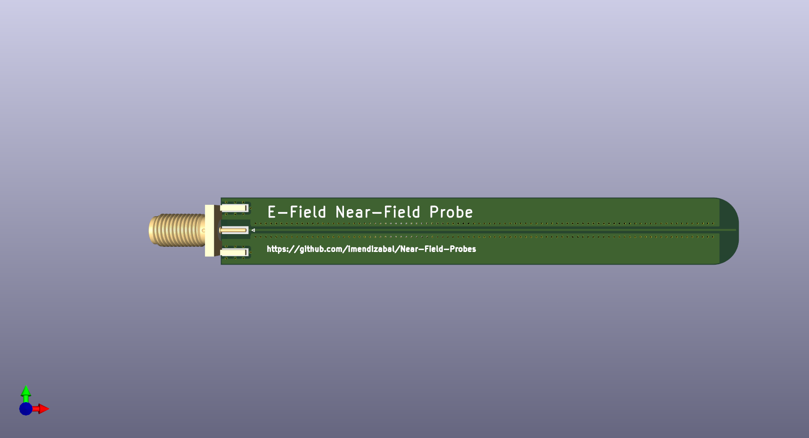
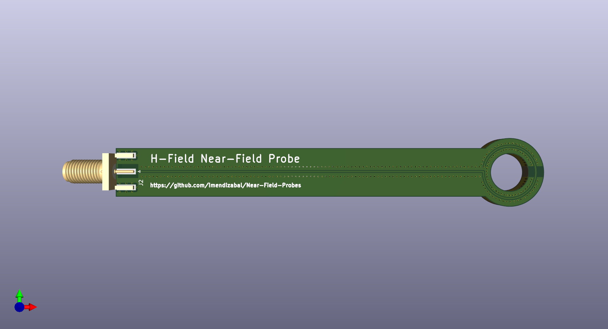

# Open-Source Near-Field Probes

## Overview
This repository provides **KiCAD PCB designs** and documentation for **Near-Field Probes** used in **EMC troubleshooting**

## Features
- **KiCAD PCB designs** for Magnetic (H-field) and Electric (E-field) probes
- **Gerber files** for easy fabrication

## Usage
1. **Download the KiCAD files** and generate Gerbers or use the ones available.
2. **Fabricate the PCB** and assemble the probes.
3. **Calibrate** the probe using a VNA
4. **Perform near-field scanning** for EMC diagnostics

## Models

## Contributions
Contributions are welcome! Feel free to submit **pull requests** with improvements or new probe designs.

## License
This project is licensed under the **GNU General Public License (GPL)** – you are free to use, modify, and distribute it, but any derivative work must also be open-source under the same license.

## Hall of Fame
[Interference Technology 2025](https://interferencetechnology.com/2025-item-magazine/)

[Hackaday page](https://hackaday.io/project/202752-near-field-probes-pcb-kit)

## About the Author
Ey, I am Ignacio! 👋🏼

I’m an electronic designer and EMC fan with experience helping companies across automotive, industrial, medical, and IoT sectors solve EMC challenges at the design stage. 
My goal is to make EMC accessible, affordable and understandable. I love creating content and making complex concepts easy.

### Where to find me?

[Linkedin](https://www.linkedin.com/in/idmendizabal/)

[Website](https://ignaciodemendizabal.com)

[Contact me](https://ignaciodemendizabal.com/contact)

### References
This work exists because of the contribution of other amazing designers and creatives

[Unit 3 Compliance Near Field Probes (Thank you James!)](https://www.unit3compliance.co.uk/probe5/)

[PCB kit in Altium](https://github.com/ketszim97/NearField_PCB_Probes)

[OpenFieldProbe](https://github.com/goopypanther/OpenFieldProbe)
